# Week 1: Introduction to Intelligent Systems

## 📌 Overview

This week introduces the unit structure, intelligent agents, and AI foundations.

---

## 🎯 Learning Outcomes

- Understand AI vs IA (Intelligent Agents)
- Learn unit assessment structure
- Set up development environment (Java + JADE)

---

## 📊 Unit Assessment

```
┌────────────────────────────────┬────────┐
│ Component                      │ Weight │
├────────────────────────────────┼────────┤
│ Project (Group)                │  50%   │
│ Continuous Oral Defence        │  50%   │
└────────────────────────────────┴────────┘
```

---

## 🗓️ Weekly Topics Overview

```mermaid
graph LR
    W1[Week 1: Intro] --> W2[Week 2: CSP]
    W2 --> W3[Week 3: MAS]
    W3 --> W4[Week 4: ML Basics]
    W4 --> W5[Week 5: ML Algorithms]
    W5 --> W6[Week 6: Neural Networks]
    W6 --> W7[Week 7: Genetic Algorithms]
    W7 --> W8[Week 8: PSO/ACO]
    W8 --> W9[Week 9: Reinforcement Learning]
    W9 --> W10[Week 10: Self-Supervised Learning]
    W10 --> W11[Week 11: Transformers]
```



---

## 📚 Project Options

| Option   | Topic                   | Focus                |
| -------- | ----------------------- | -------------------- |
| **A-T1** | Vehicle Routing Problem | MAS + Optimization   |
| **A-T2** | Traffic Flow Prediction | ML + Neural Networks |
| **C**    | LLM Hallucination       | NLP + RAG            |

---

## 🛠️ Tools & Resources

- **JADE**: Java Agent DEvelopment Framework
- **Python**: For ML/DL components
- **Libraries**: PyTorch, TensorFlow, Keras, scikit-learn
- **VCS**: Git (GitHub/GitLab/Bitbucket)

---

## 📖 Recommended Reading

1. Russell & Norvig - _Artificial Intelligence: A Modern Approach_ (3rd/4th ed.)
2. Negnevitsky - _Artificial Intelligence: A Guide to Intelligent Systems_
3. Wooldridge - _An Introduction to Multi-Agent Systems_
