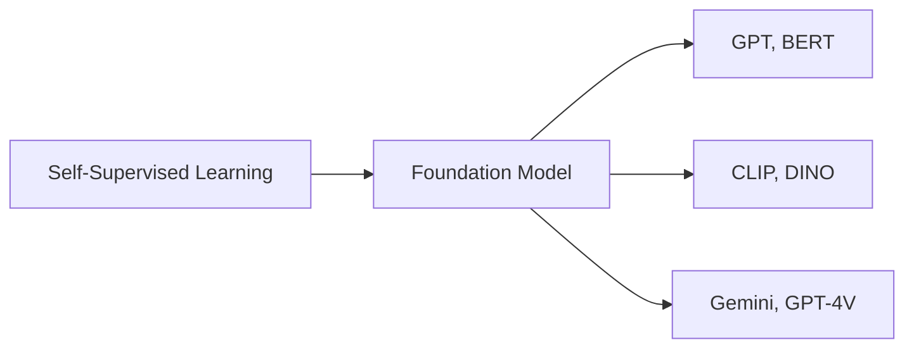

# Week 10: Self-Supervised Learning (SSL)

## 📌 Core Concept

SSL learns representations from unlabeled data using pretext tasks.

---

## 🔄 SSL vs Traditional Learning

```
┌─────────────────────┬─────────────────────┐
│  SUPERVISED         │  SELF-SUPERVISED    │
├─────────────────────┼─────────────────────┤
│ Needs labeled data  │ Uses unlabeled data │
│ Labels are costly   │ Creates own labels  │
│ Limited by labels   │ Scales with data    │
└─────────────────────┴─────────────────────┘
```

---

## 🏗️ Two-Phase Framework

```
┌─────────────────┐      ┌──────────────────┐
│   PRETRAINING   │  →   │    ADAPTATION    │
├─────────────────┤      ├──────────────────┤
│ Learn from      │      │ Fine-tune for    │
│ unlabeled data  │      │ specific task    │
│ (pretext tasks) │      │ (downstream)     │
└─────────────────┘      └──────────────────┘
```

---

## 🎯 Pretext Task Types

### 1. Self-Prediction

Predict one part of data from another part.

| Method             | Task                             |
| ------------------ | -------------------------------- |
| **Autoregressive** | Predict next word/pixel          |
| **Masked**         | Fill in blanked portions         |
| **Denoising**      | Reconstruct from corrupted input |

```
GPT:  "The cat sat on the ___" → "mat"
BERT: "The [MASK] sat on the mat" → "cat"
```

### 2. Contrastive Learning

Learn by comparing similar and dissimilar samples.

```
┌─────────────────────────────────────┐
│   Similar pairs → CLOSE            │
│   Dissimilar pairs → FAR APART     │
│         in embedding space         │
└─────────────────────────────────────┘
```

---

## 🖼️ Image Augmentation for Contrastive Learning

```
Original Image
      │
      ├── Crop → Positive pair
      ├── Rotate → Positive pair
      ├── Color jitter → Positive pair
      │
Other images → Negative pairs
```

---

## 📐 Contrastive Loss (InfoNCE)

```
L = -log [ exp(sim(z, z⁺)/τ) ]
          ─────────────────────
          Σ exp(sim(z, z⁻)/τ)

where:
  z⁺ = positive sample (augmented version)
  z⁻ = negative samples (other images)
  τ = temperature parameter
```

---

## 🧠 Foundation Models



---

## 🔧 Adaptation Methods

| Method            | Description                      |
| ----------------- | -------------------------------- |
| **Fine-tuning**   | Update all/some weights          |
| **Linear probe**  | Freeze encoder, train classifier |
| **Prompt tuning** | Learn task-specific prompts      |
| **LoRA**          | Low-rank adaptation              |

---

## 🌍 Applications

| Domain       | Application                      |
| ------------ | -------------------------------- |
| **NLP**      | Text understanding (BERT)        |
| **Vision**   | Image classification (DINO)      |
| **Audio**    | Speech recognition (wav2vec)     |
| **Genertic** | Text-to-image (Stable Diffusion) |

---

## 🎯 Project Relevance

- **Traffic Flow**: Pretrain on unlabeled traffic data
- **SAE (Stacked Autoencoder)**: Self-prediction for feature learning
- **Transfer Learning**: Adapt pretrained models to specific datasets
