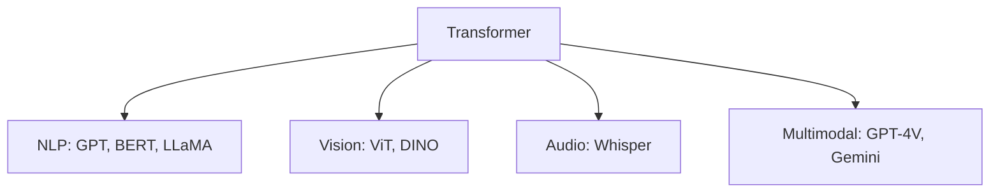

# Week 11: RNNs, LSTM & Transformers

## 📌 Core Concept

Architectures designed to process sequential data.

---

## 📊 Sequence Data Types

| Type            | Examples              |
| --------------- | --------------------- |
| **Text**        | Sentences, documents  |
| **Audio**       | Speech, music         |
| **Time Series** | Stock prices, weather |
| **Video**       | Frame sequences       |

---

## 🔄 Recurrent Neural Networks (RNN)

### Architecture

```
    ┌────┐   ┌────┐   ┌────┐   ┌────┐
x₁ →│ h₁ │→ │ h₂ │→ │ h₃ │→ │ h₄ │→ y
    └────┘   └────┘   └────┘   └────┘
      ↓        ↓        ↓        ↓
     y₁       y₂       y₃       y₄
```

### Update Equations

```
hₜ = tanh(W_h · xₜ + W_hh · hₜ₋₁ + b)
yₜ = W_y · hₜ
```

### Limitations

- Vanishing/exploding gradients
- Limited long-term memory
- Sequential processing (no parallelization)

---

## 🧠 LSTM (Long Short-Term Memory)

### Key Innovation: Cell State

```
─────────────────────────────────→ Cell State (long-term)
    │           │           │
    ╳           ╳           ╳
 Forget      Input       Output
  Gate        Gate         Gate
```

### Gates

| Gate       | Function                    |
| ---------- | --------------------------- |
| **Forget** | What to discard from memory |
| **Input**  | What new info to store      |
| **Output** | What to output              |

---

## 🔀 GRU (Gated Recurrent Unit)

Simplified LSTM with fewer parameters:

- **Reset gate**: How much past to forget
- **Update gate**: How much to update hidden state

```
LSTM: 3 gates + cell state
GRU:  2 gates (simpler, faster)
```

---

## ⚡ Transformer Architecture

### Key Innovation: Self-Attention

"Attention Is All You Need" (Vaswani et al., 2017)

```
┌─────────────────────────────────────┐
│           TRANSFORMER               │
├─────────────────────────────────────┤
│ ┌─────────────┐  ┌─────────────┐   │
│ │   ENCODER   │  │   DECODER   │   │
│ │             │→ │             │   │
│ │ Self-Attn   │  │ Self-Attn   │   │
│ │ Feed-Fwd    │  │ Cross-Attn  │   │
│ │             │  │ Feed-Fwd    │   │
│ └─────────────┘  └─────────────┘   │
└─────────────────────────────────────┘
```

---

## 🔍 Self-Attention Mechanism

### Query-Key-Value

```
Attention(Q, K, V) = softmax(QKᵀ/√d) · V
```

### Intuition

```
"The cat sat on the mat because it was tired"
                              │
                  What does "it" refer to?
                              ↓
              Attention connects "it" to "cat"
```

---

## 📐 Positional Encoding

Since transformers process all positions simultaneously:

```
Position info added via:
PE(pos, 2i)   = sin(pos/10000^(2i/d))
PE(pos, 2i+1) = cos(pos/10000^(2i/d))
```

---

## 🆚 Architecture Comparison

| Aspect          | RNN  | LSTM   | Transformer |
| --------------- | ---- | ------ | ----------- |
| Parallelization | ❌   | ❌     | ✅          |
| Long-range deps | ❌   | ✅     | ✅✅        |
| Training speed  | Slow | Slow   | Fast        |
| Memory          | Low  | Medium | High        |

---

## 🌍 Transformer Applications



---

## 🎯 Foundation for LLMs

- **Encoder-only**: BERT (understanding)
- **Decoder-only**: GPT (generation)
- **Encoder-Decoder**: T5, BART (translation)

---

## 📚 Key Takeaways

1. RNNs process sequences but suffer from gradient issues
2. LSTM/GRU solve vanishing gradients with gating
3. Transformers enable parallel processing via attention
4. Self-attention captures long-range dependencies
5. Transformers are the foundation of modern AI
