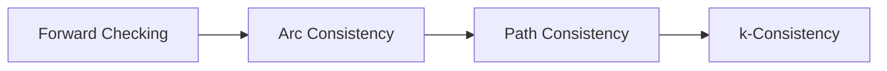

# Week 2: Constraint Satisfaction Problems (CSP)

## 📌 Core Concept

CSP is a problem-solving paradigm where the goal is to find values for variables that satisfy all given constraints.

---

## 🧩 CSP Components

```
┌─────────────────────────────────────────┐
│           CSP = (X, D, C)               │
├─────────────────────────────────────────┤
│ X = {X₁, X₂, ..., Xₙ}  → Variables      │
│ D = {D₁, D₂, ..., Dₙ}  → Domains        │
│ C = {C₁, C₂, ..., Cₘ}  → Constraints    │
└─────────────────────────────────────────┘
```

---

## 🔍 Search Algorithms

### Backtracking Search

```
┌─────────────────────────────────────┐
│ 1. Select unassigned variable       │
│ 2. Try each value in domain         │
│ 3. If consistent → recurse          │
│ 4. If fail → backtrack              │
│ 5. Repeat until solution or no more │
└─────────────────────────────────────┘
```

---

## 🚀 Optimization Heuristics

| Heuristic  | Strategy                                        | Effect            |
| ---------- | ----------------------------------------------- | ----------------- |
| **MRV**    | Most constrained variable (fewest legal values) | Fail early        |
| **Degree** | Most constraining variable                      | Reduce branches   |
| **LCV**    | Least constraining value                        | Keep options open |

---

## 🔗 Constraint Propagation

### Arc Consistency (AC-3)

- **Arc X→Y** is consistent if: for every value x in X, there exists an allowed y in Y
- Removes inconsistent values early
- Detects failures before backtracking



---

## 💡 Key Techniques

| Technique            | Description                                                  |
| -------------------- | ------------------------------------------------------------ |
| **Forward Checking** | Remove inconsistent values after each assignment             |
| **Arc Consistency**  | Enforce X→Y consistency for all arcs                         |
| **Min-Conflicts**    | Local search - choose value that violates fewest constraints |

---

## 🌍 Real-World Applications

- Timetabling (class scheduling)
- Resource allocation
- Vehicle routing
- Configuration problems
- N-Queens puzzle

---

## 🛠️ Tool: Choco Solver

Java constraint programming library for solving CSPs.

- Supports various constraint types
- Built-in search strategies
- Integrates well with JADE agents
