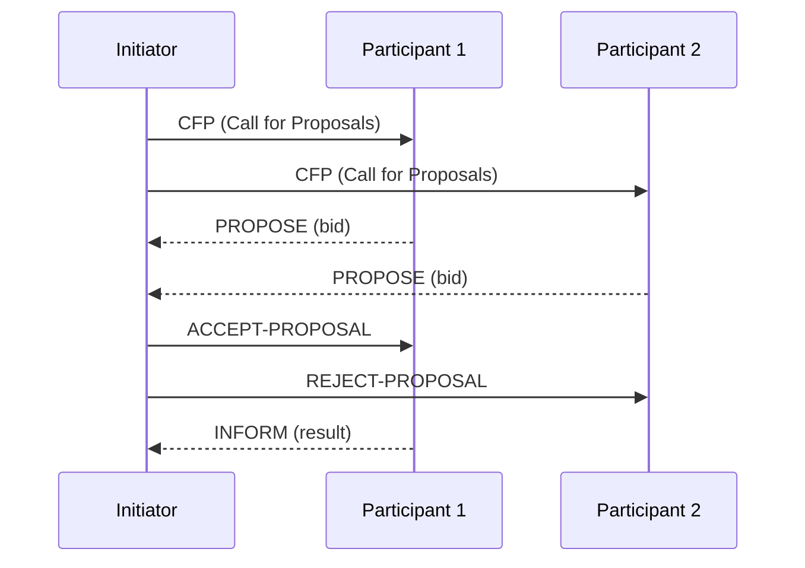

# Week 3: Multi-Agent Systems (MAS)

## 📌 Core Concepts

MAS involves multiple autonomous agents interacting to solve problems collectively.

---

## 🤖 Agent Characteristics

```
┌──────────────────────────────────────┐
│           AGENT PROPERTIES           │
├──────────────────────────────────────┤
│ • Autonomy    - Self-directed        │
│ • Reactivity  - Perceives & responds │
│ • Proactivity - Goal-directed        │
│ • Social      - Interacts with others│
└──────────────────────────────────────┘
```

---

## 💬 Agent Communication

### FIPA-ACL Performatives

| Performative      | Purpose                     |
| ----------------- | --------------------------- |
| `REQUEST`         | Ask agent to perform action |
| `INFORM`          | Share information/beliefs   |
| `PROPOSE`         | Make a proposal             |
| `ACCEPT-PROPOSAL` | Accept a proposal           |
| `REJECT-PROPOSAL` | Reject a proposal           |
| `CFP`             | Call for proposals          |

---

## 🔄 Interaction Protocols

### Contract Net Protocol



---

## 📈 Utility Functions

### Multi-Attribute Utility (MAU)

```
MAU(x₁,...,xₙ) = Σ wᵢ · uᵢ(xᵢ)

where:
  wᵢ = weight of attribute i
  uᵢ = utility function for attribute i
```

---

## 🤝 Negotiation Strategies

| Strategy           | Description                            |
| ------------------ | -------------------------------------- |
| **Conceder**       | Quickly concedes to reservation value  |
| **Boulware**       | Maintains initial offer until deadline |
| **Tit-for-Tat**    | Mimics opponent's concession behavior  |
| **Time-dependent** | Concession based on time remaining     |

---

## 📊 Negotiation Diagram

```
Price ↑
      │ Seller's Range
   RV_B ├─────────────────┐
      │   Agreement     ├─────
      │     Zone        │
   RV_S ├─────────────────┘
      │ Buyer's Range
      └───────────────────────→ Rounds
```

---

## 🛠️ JADE Framework

### Key Components

- **Agent**: Base class for all agents
- **Behaviour**: Actions agents can perform
- **Message**: ACL message for communication
- **AMS**: Agent Management System
- **DF**: Directory Facilitator

### Agent Lifecycle

```
INITIATED → ACTIVE → SUSPENDED → WAITING → DELETED
```

---

## 🎯 Project Relevance

- **VRP Project**: DAs communicate with MRA using protocols
- Master Routing Agent coordinates delivery agents
- Negotiation for route assignments
