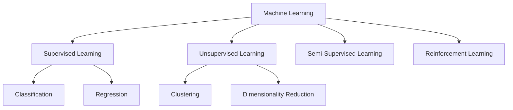

# Week 4: Machine Learning Fundamentals

## 📌 Core Concept

ML enables systems to learn from data without being explicitly programmed.

---

## 🎯 Types of Learning



---

## 📊 ML Problem Types

| Type               | Output           | Example                |
| ------------------ | ---------------- | ---------------------- |
| **Regression**     | Continuous value | House price prediction |
| **Classification** | Discrete label   | Spam detection         |
| **Clustering**     | Groups           | Customer segmentation  |

---

## 🔢 Linear Regression

### Model

```
y = θ₀ + θ₁x₁ + θ₂x₂ + ... + θₙxₙ
```

### Cost Function (MSE)

```
J(θ) = (1/2m) Σᵢ (hθ(xⁱ) - yⁱ)²
```

### Gradient Descent

```
θⱼ := θⱼ - α · ∂J(θ)/∂θⱼ
```

---

## 🔄 ML Pipeline

```
┌─────────┐   ┌──────────┐   ┌─────────┐   ┌──────────┐
│  Data   │ → │ Feature  │ → │  Model  │ → │ Evaluate │
│ Collect │   │ Engineer │   │ Training│   │  & Tune  │
└─────────┘   └──────────┘   └─────────┘   └──────────┘
```

---

## 📈 ML Components

| Component          | Description                                         |
| ------------------ | --------------------------------------------------- |
| **Representation** | How hypothesis is structured (trees, NNs, etc.)     |
| **Optimization**   | Search for best parameters (gradient descent, etc.) |
| **Evaluation**     | Measure performance (accuracy, MSE, etc.)           |

---

## 🧮 Function Representations

### Numerical Functions

- Linear regression
- Neural networks
- Support Vector Machines

### Symbolic Functions

- Decision trees
- Rule-based systems

### Instance-based

- k-Nearest Neighbors
- Case-based reasoning

### Probabilistic Models

- Naïve Bayes
- Bayesian Networks
- Hidden Markov Models

---

## 📏 Evaluation Metrics

| Metric        | Formula               | Use Case       |
| ------------- | --------------------- | -------------- |
| **Accuracy**  | (TP+TN)/(TP+TN+FP+FN) | Classification |
| **MSE**       | (1/n)Σ(y-ŷ)²          | Regression     |
| **Precision** | TP/(TP+FP)            | When FP costly |
| **Recall**    | TP/(TP+FN)            | When FN costly |

---

## 🛠️ Python Libraries

- **NumPy**: Numerical computations
- **Pandas**: Data manipulation
- **Scikit-learn**: ML algorithms
- **Matplotlib/Seaborn**: Visualization
