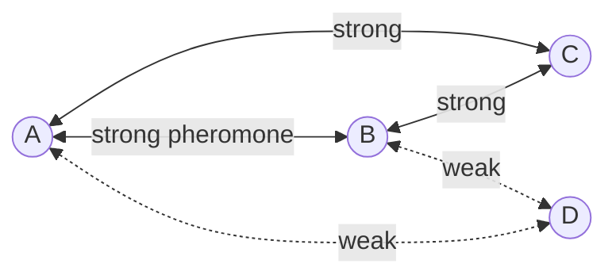

# Week 8: Particle Swarm & Ant Colony Optimization

## 📌 Core Concept

Swarm intelligence algorithms inspired by collective behavior of social organisms.

---

## 🐦 Particle Swarm Optimization (PSO)

### Inspiration

Flocking behavior of birds searching for food.

### Key Components

```
┌─────────────────────────────────────┐
│ Each particle tracks:               │
│ • Position (xᵢ) - current solution  │
│ • Velocity (vᵢ) - movement direction│
│ • pBest - personal best position    │
│ • gBest - global best in swarm      │
└─────────────────────────────────────┘
```

### Update Rules

```
vᵢ = vᵢ + c₁·rand·(pBest - xᵢ) + c₂·rand·(gBest - xᵢ)
xᵢ = xᵢ + vᵢ

where:
  c₁ = cognitive coefficient (local influence)
  c₂ = social coefficient (global influence)
```

---

## 📊 PSO Visualization

```
           pBest
              ●
             /
current →  ●──────────────→ new position
            \
             gBest
              ●

Particle moves toward both pBest and gBest
```

---

## 🐜 Ant Colony Optimization (ACO)

### Inspiration

Ants finding shortest paths using pheromone trails.

### Key Concept: Stigmergy

Indirect communication via environment (pheromone).

```
Nest ═══════════╗            ╔═══════════ Food
                ║  shorter   ║
                ╚════════════╝
                   (more pheromone)
```

---

## 🔄 ACO Algorithm

```
1. Initialize pheromone trails
2. For each iteration:
   a. Each ant constructs a solution
   b. Ants deposit pheromone on path
   c. Pheromone evaporates
3. Return best solution found
```

### Transition Probability

```
P(x→y) = [τ(x,y)]ᵅ · [η(x,y)]ᵝ
         ─────────────────────
         Σ [τ(x,z)]ᵅ · [η(x,z)]ᵝ

where:
  τ = pheromone level
  η = heuristic (e.g., 1/distance)
  α, β = influence parameters
```

### Pheromone Update

```
τ(x,y) = (1-ρ)·τ(x,y) + Δτ(x,y)

where:
  ρ = evaporation rate
  Δτ = deposited pheromone
```

---

## 🆚 PSO vs ACO Comparison

| Aspect             | PSO                    | ACO                    |
| ------------------ | ---------------------- | ---------------------- |
| **Inspiration**    | Bird flocking          | Ant foraging           |
| **Solution space** | Continuous             | Discrete (graphs)      |
| **Memory**         | pBest, gBest           | Pheromone trails       |
| **Best for**       | Numerical optimization | Combinatorial problems |

---

## 🚚 TSP Example (ACO)



---

## 🎯 Project Relevance (VRP)

### Using PSO

- Optimize route parameters
- Tune weights in objective function

### Using ACO

- Build routes incrementally
- Cities = nodes, routes = edges
- Pheromone guides route selection

---

## ⚙️ Algorithm Parameters

### PSO Parameters

| Parameter      | Typical Range |
| -------------- | ------------- |
| Swarm size     | 20-50         |
| c₁ (cognitive) | 1.5-2.0       |
| c₂ (social)    | 1.5-2.0       |
| Inertia w      | 0.4-0.9       |

### ACO Parameters

| Parameter       | Typical Range |
| --------------- | ------------- |
| Ants            | 10-50         |
| α (pheromone)   | 1-2           |
| β (heuristic)   | 2-5           |
| ρ (evaporation) | 0.1-0.5       |
