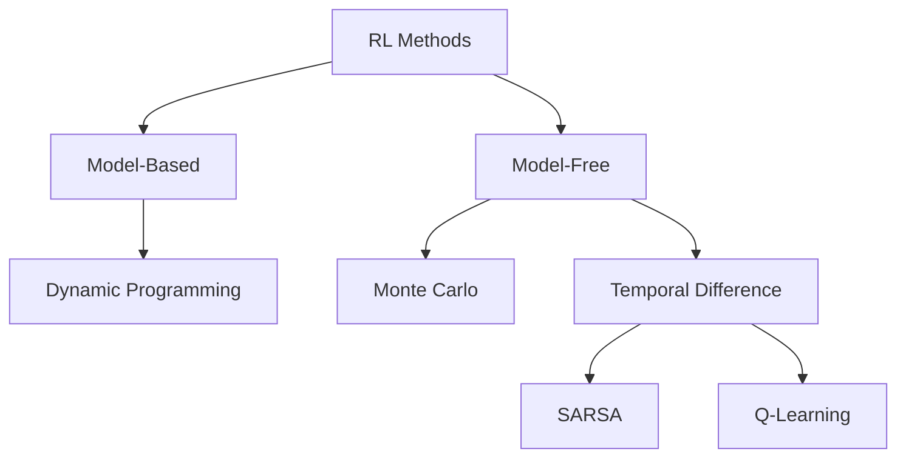

# Week 9: Reinforcement Learning

## 📌 Core Concept

RL trains agents to make sequential decisions by learning from rewards.

---

## 🎮 RL Framework

```
┌─────────────────────────────────────────┐
│                                         │
│    ┌───────┐   action aₜ    ┌─────────┐│
│    │ AGENT │──────────────►│ENVIRONMENT││
│    │       │◄──────────────│         ││
│    └───────┘  state sₜ₊₁   └─────────┘│
│               reward rₜ₊₁              │
│                                         │
└─────────────────────────────────────────┘
```

---

## 📊 Key Components

| Component   | Symbol | Description              |
| ----------- | ------ | ------------------------ |
| **State**   | s ∈ S  | Current situation        |
| **Action**  | a ∈ A  | Agent's choice           |
| **Reward**  | r      | Immediate feedback       |
| **Policy**  | π(s)   | State → Action mapping   |
| **Value**   | V(s)   | Expected future reward   |
| **Q-value** | Q(s,a) | Value of action in state |

---

## 🎯 Goal

Find optimal policy π\* that maximizes expected cumulative reward:

```
R = r₀ + γr₁ + γ²r₂ + γ³r₃ + ...

where γ = discount factor (0 < γ < 1)
```

---

## 📐 Bellman Equation

### State Value Function

```
V^π(s) = r(s) + γ · Σ P(s'|s, π(s)) · V^π(s')
```

### Optimal Value

```
V*(s) = r(s) + γ · max_a Σ P(s'|s,a) · V*(s')
```

---

## 🧮 Solution Methods



---

## 📊 Method Comparison

| Method                  | Requires Model | Updates        |
| ----------------------- | -------------- | -------------- |
| **Dynamic Programming** | Yes            | All states     |
| **Monte Carlo**         | No             | End of episode |
| **TD Learning**         | No             | Every step     |

---

## 🎲 Q-Learning

### Update Rule

```
Q(s,a) ← Q(s,a) + α[r + γ·max_a' Q(s',a') - Q(s,a)]

where:
  α = learning rate
  γ = discount factor
```

### Algorithm

```
1. Initialize Q(s,a) arbitrarily
2. For each episode:
   a. Initialize state s
   b. For each step:
      - Choose action a (ε-greedy)
      - Take action, observe r, s'
      - Update Q(s,a)
      - s ← s'
```

---

## 🔍 Exploration vs Exploitation

### ε-Greedy Policy

```
a = { argmax_a Q(s,a)  with prob (1-ε)
    { random action     with prob ε
```

---

## 🌍 Applications

| Domain   | Example                  |
| -------- | ------------------------ |
| Games    | Chess, Go, Atari         |
| Robotics | Navigation, manipulation |
| Trading  | Portfolio optimization   |
| Control  | Autonomous vehicles      |

---

## 🛠️ Getting Started

- **OpenAI Gym**: Standard RL environments
- **Stable Baselines**: Pre-built RL algorithms
- Classic problems: CartPole, MountainCar, LunarLander
